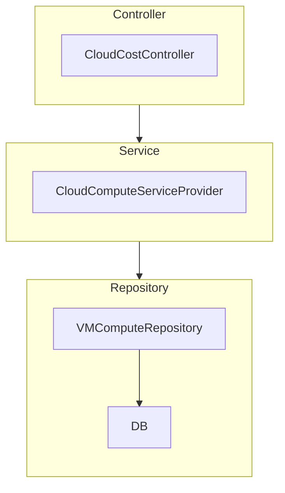

# cloudcost-inspector
To inspect cloud cost and advise accordingly

## Features
- Architecture Layers: 

```
- Controller -> Service -> Repository - DONE
- REST API (OpenAPI Specification)
- HTTP Standard - API Best Practices for Error Codes
- Health Metrics using Actuator - DONE
- Enable Transaction Management
- JPA (SQL) using Spring Data - DONE
- JPA (NOSQL - MongoDB)
- Exception Handling
- Global Exception Handler
- Event-driven Service
- Docker Image - DONE
- Enable Native Image
- Java Best Practices - Generics, Streams
- Lombok (Getter/Setter) Code Generation - DONE
- Spring Boot Best Practices
- Logging using SL4J Lombok - DONE
- Auditing JPA - DONE
- Prometheus Instrumentation - DONE
- Configured GitHub Action to build Docker Image - DONE
- Supports Docker Image building using Spring Plugin (gradle bootBuildImage)
- Build Docker Image using JIB
- GraphQL
- For Kubernetes (Liveness & Readiness Probe) - DONE
- Swagger - DONE
- Pageable Response using Spring - DONE
- Spring Boot 3 with OpenAPI (with actuator integration) - DONE
- Use Buildpack
```
## Jenkins Setup
- Tools required: Git, Gradle, Docker
- Plugins: Snyk Security, SonarQube

## REST Endpoints
- Health: [Prometheus Metrics](http://localhost:8080/actuator/prometheus), [Actuator](http://localhost:8080/actuator/)
- Docs: [Swagger URL](http://localhost:8080/swagger-ui/index.html)
- [OpenAPI Docs](http://localhost:8080/api-docs/)
- DB: [H2-Console](http://localhost:8080/h2-console)
- API Endpoints: [VM Rest API](http://localhost:8080/compute/virtualmachines)

## References:
- [For Spring Boot 3 with OpenAPI](https://springdoc.org/v2/)
- https://spring.io/guides/tutorials/rest/
- https://github.com/spring-guides/tut-rest
- https://medium.com/@berkaybasoz/spring-boot-h2-database-setup-6996a1c18cc
- https://github.com/eugenp/tutorials/blob/master/persistence-modules/spring-jpa-2/
- https://www.baeldung.com/spring-rest-openapi-documentation
- https://www.baeldung.com/intro-to-project-lombok
- https://www.baeldung.com/database-auditing-jpa
- https://docs.spring.io/spring-data/jpa/docs/1.7.0.DATAJPA-580-SNAPSHOT/reference/html/auditing.html
- https://docs.spring.io/spring-boot/docs/current/reference/html/actuator.html
- https://www.baeldung.com/spring-boot-actuators
- https://www.baeldung.com/spring-liveness-readiness-probes
- https://spring.io/blog/2020/03/25/liveness-and-readiness-probes-with-spring-boot
- [Prometheus Instrumentation](https://www.baeldung.com/spring-boot-self-hosted-monitoring)
- [Docker Image in Spring](https://spring.io/blog/2020/01/27/creating-docker-images-with-spring-boot-2-3-0-m1)